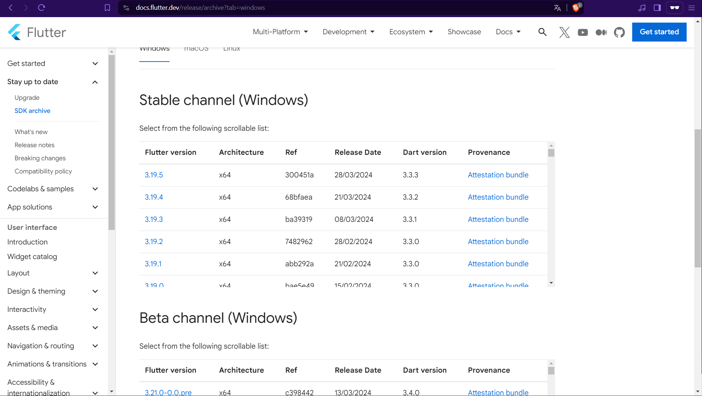
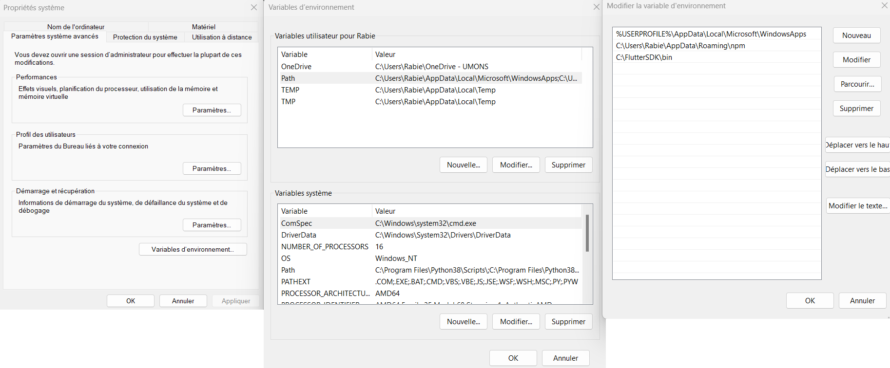
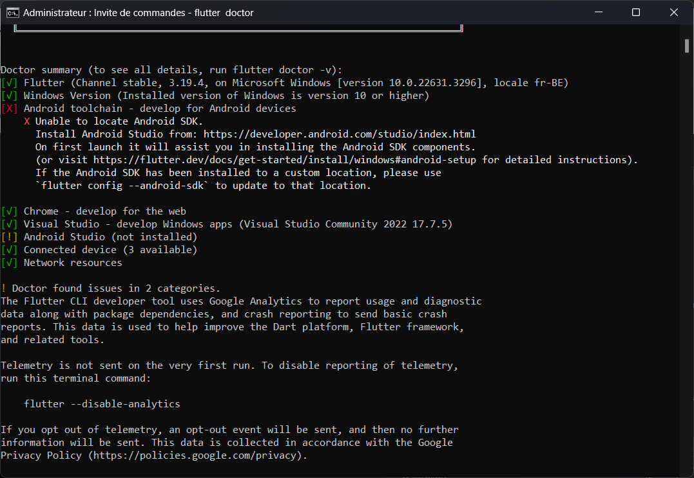
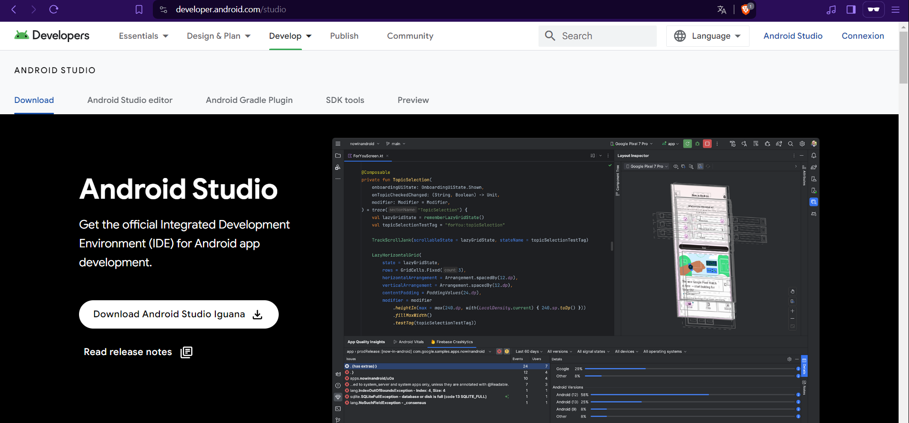
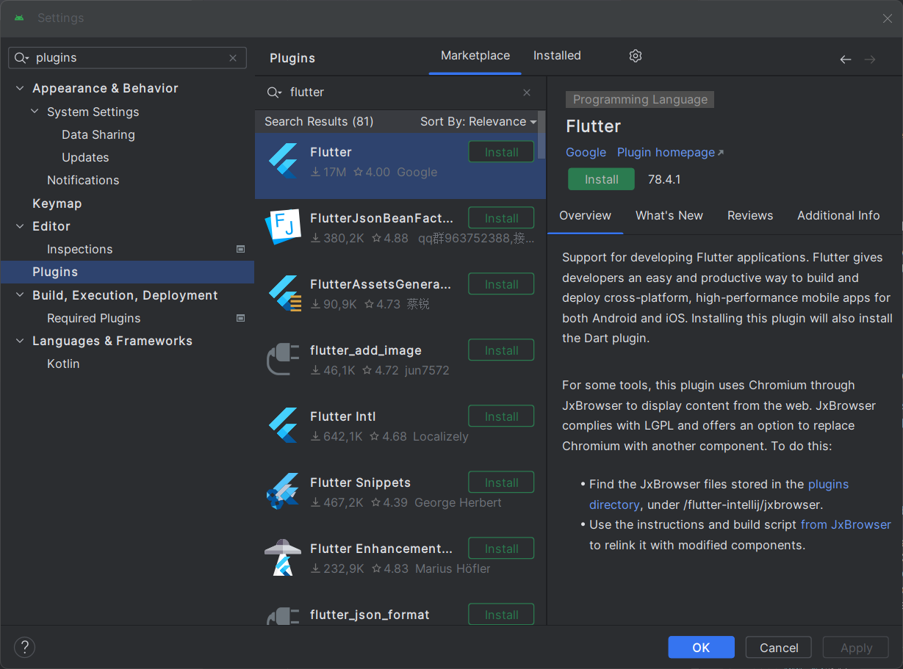
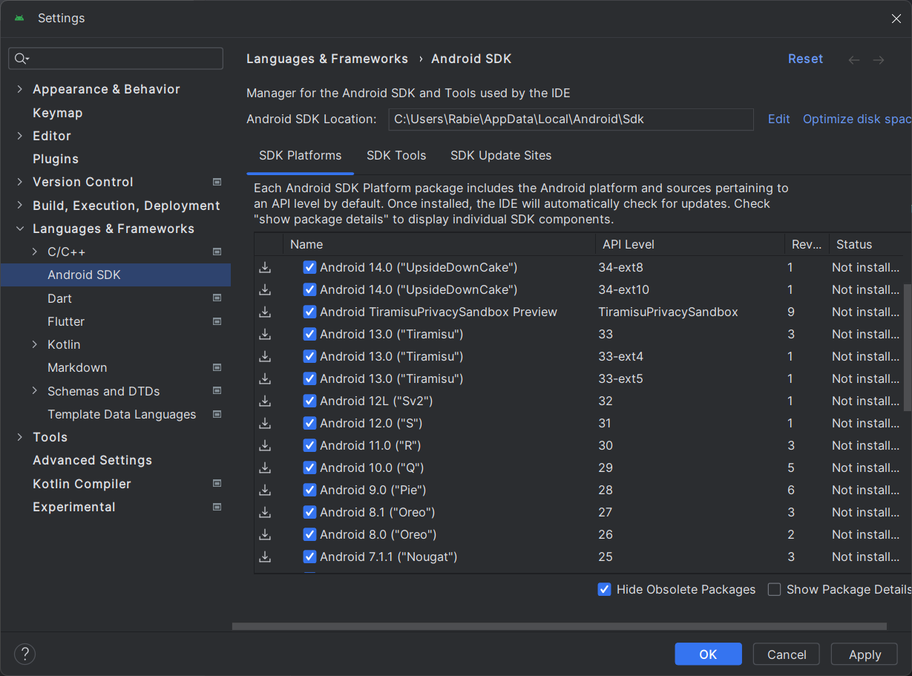
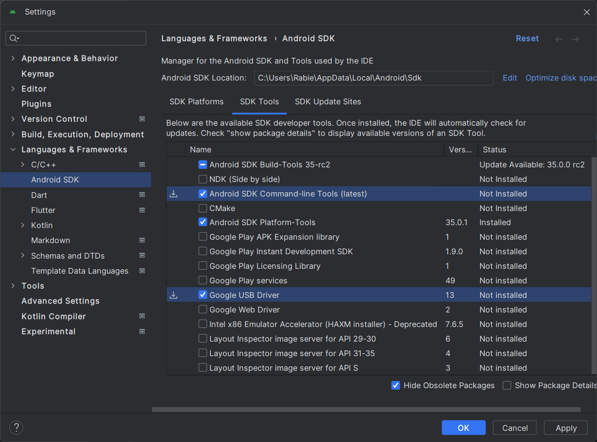
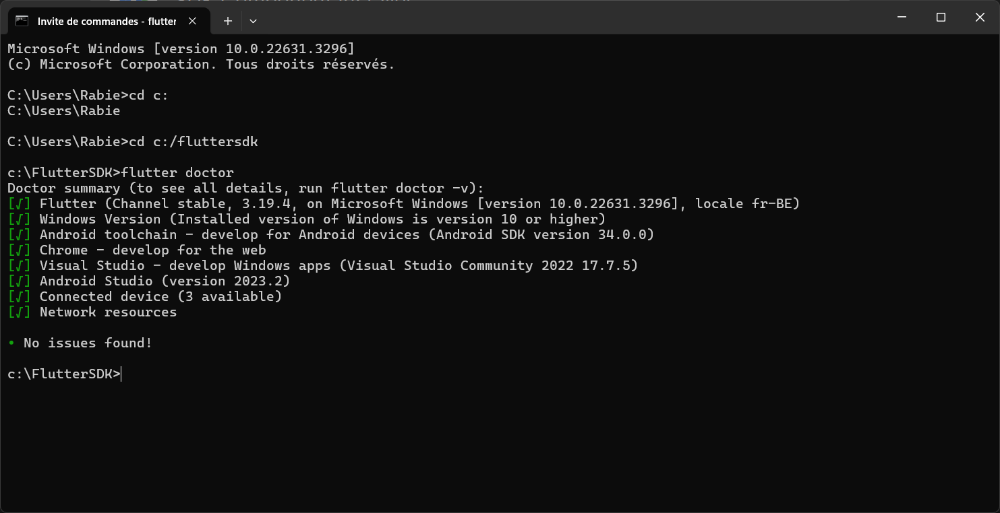
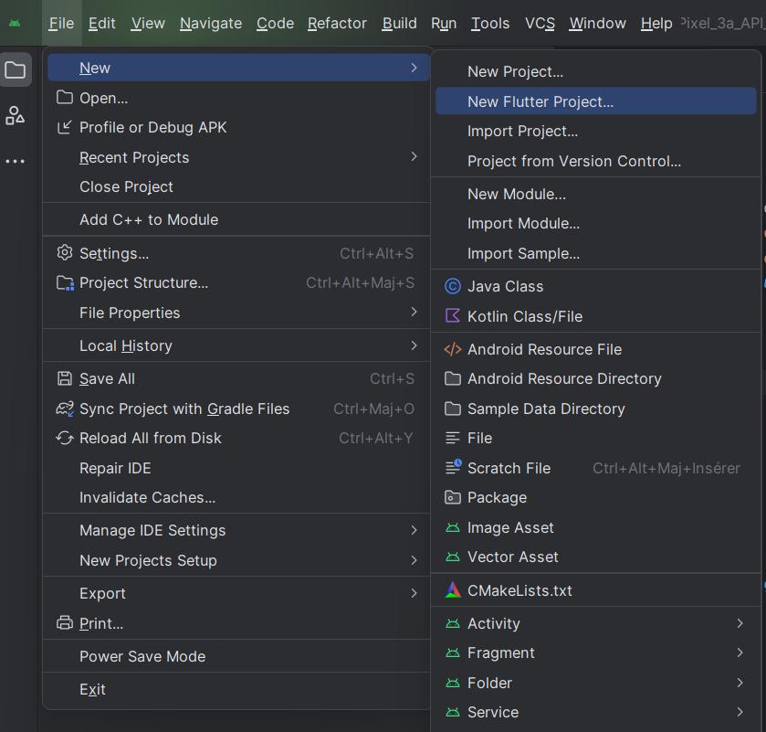
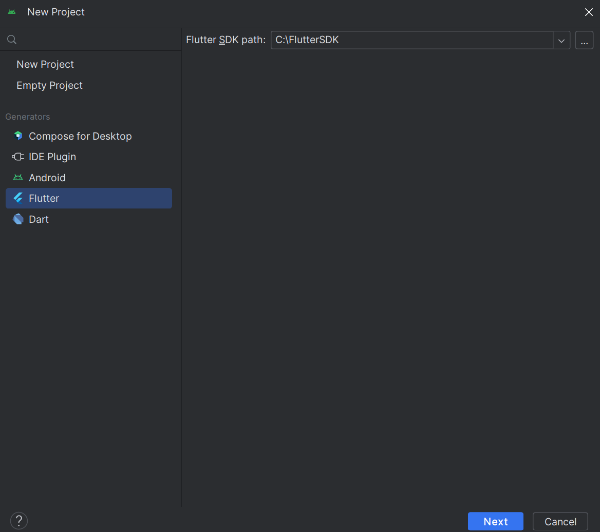

---
title: "Installation"

---
# Flutter – Installation

L’utilisation de Flutter nécessite au préalable l’installation de **Flutter SDK** et ensuite d’**Android Studio**. 
Cette notice présente les étapes successives d’installation de ces différents composants.
Avant de commencer, veuillez vérifier que vous disposez de la configuration requise.

## Configuration requise

- Windows 7 SP1 ou supérieur (**version 64 bits**)
- Espace disque disponible **> 1.5 Go**
- Les outils **Windows PowerShell** et **Git** installés ([Télécharger Git](https://git-scm.com/download/win)).

---

## Conventions

:::tip Convention de couleurs
- **🟣 Violet** : Éléments qui peuvent varier en fonction de votre configuration et doivent être adaptés.
- **🔴 Rouge** : Chaînes de caractères qui doivent être encodées.
- **🟢 Vert** : Chaînes de caractères à identifier.
:::

---

## Étape 1 – Installation du Flutter SDK

Ce SDK contient un ensemble d’outils permettant de compiler le code développé en Dart pour les plateformes Android et iOS.

1. **Créez un répertoire** : `🟣 C:\FlutterSDK`
2. **Rendez-vous à l'adresse** : [Flutter SDK Releases](https://flutter.dev/docs/development/tools/sdk/releases)
3. **Téléchargez la dernière version stable** du SDK.

4. **Décompressez** l’archive ZIP.
5. **Copiez le contenu du sous-répertoire `flutter`** dans `🟣 C:\FlutterSDK`.

---

## Étape 2 – Création des variables d'environnement

1. Tapez **🔴 env** dans la barre de recherche de Windows.
2. Cliquez sur **🟢 Variables d'environnement**.
3. Identifiez la variable **🟢 Path** dans les variables utilisateur.
4. Double-cliquez sur **🟢 Path**.
5. Cliquez sur **🟢 Ajouter**.
6. Ajoutez une nouvelle ligne : `🟣 C:\FlutterSDK\bin`.
7. Cliquez sur **🟢 OK**.

---

## Étape 3 – Vérification de l'installation de Flutter

1. Ouvrez **l'Invite de commande** (`cmd`).
2. Tapez `🟣 cd C:\FlutterSDK` puis `🔴 flutter doctor`.
3. Vérifiez que toutes les dépendances sont bien installées.

> **Note** : Si `flutter doctor` ne se lance pas, vérifiez l'étape 2.

---

## Étape 4 – Installation d'Android Studio

1. Rendez-vous sur [Android Studio](https://developer.android.com/studio)
2. Téléchargez et installez Android Studio.

3. Acceptez les conditions d'utilisation.
4. Suivez l'assistant d'installation.
5. Une fois installé, ouvrez Android Studio.

---

## Étape 5 – Configuration d'Android Studio

1. Ouvrez **Android Studio**.
2. Allez dans **🟢 File > Settings > Plugins**.

3. Recherchez **Flutter**, installez-le puis redémarrez l'IDE.
4. Allez dans **🟢 Tools > SDK Manager**.
5. Cochez toutes les versions d'Android supérieures à 6.

6. Dans **🟢 SDK Tools**, cochez **🟢 Google USB Driver** et **🟢 Android SDK Command-line Tools (latest)**.

---

## Étape 6 – Validation de l'installation

1. Ouvrez une **Invite de commande** (`cmd`).
2. Tapez `🔴 flutter doctor --android-licenses` et acceptez les licences.
3. Tapez `🔴 flutter doctor` pour vérifier que tout est configuré.

4. Si tout est correct, vous devriez voir `🟢 No issues found`.

---

## Étape 7 – Création d'un projet Flutter

1. Ouvrez **Android Studio**.
2. Allez dans **🟢 File > New > New Flutter Project**.

3. Choisissez l'option **🟣 Flutter** et renseignez le chemin **🟣 C:\FlutterSDK** comme emplacement du SDK Flutter. 

> **Note** : le nom de votre projet doit uniquement comprendre des lettres minuscules et des underscores (_). 
4. Configurez le projet et cliquez sur **🟢 Finish**.
5. Accédez à l'onglet Device Manager et sélectionnez un émulateur et lancez l'application.

> **Note** : La première exécution peut prendre plusieurs minutes en raison du téléchargement des dépendances.

Vous êtes maintenant prêt à développer avec Flutter ! 🚀
