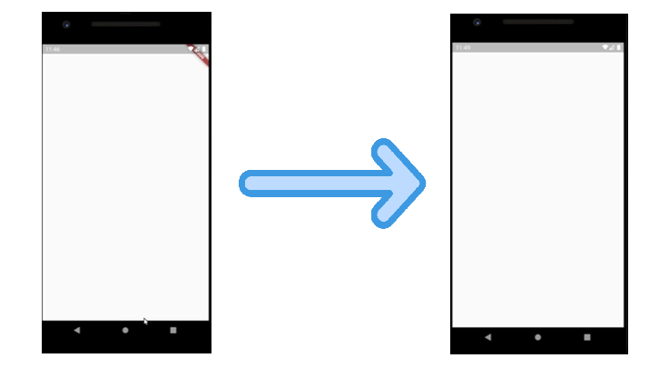

---
title: "Flutter – TP1"
description: "Première séance de travaux pratiques avec Flutter"
id: flutter-tp1
slug: /flutter-tp1
---

# Flutter TP1

Les objectifs de cette première séance de travaux pratiques Flutter sont :

- **🟦 Découvrir et manipuler la notion des Widgets**
- **🟦 Manipuler les styles**

---

## **Exercice 1 : Scaffold et AppBar**

Créez un nouveau projet Flutter. Nous allons recréer l'interface graphique **from scratch**. Supprimez le contenu de la classe `MyApp` entièrement.

Nous allons créer notre propre classe `MyApp` :

```dart
class MyApp extends StatelessWidget {
  @override
  Widget build(BuildContext context) {
    return MaterialApp();
  }
}
```

Nous aurons une erreur à la compilation, car il manque la propriété **home** dans `MaterialApp`.

Pour voir la liste des arguments possibles, appuyez sur **🔴 Ctrl + Espace** à l'intérieur des parenthèses de `MaterialApp()`.

Définissez **Scaffold()** comme widget pour le `home` :

```dart
return MaterialApp(home: Scaffold(),);
```

Il n'y a plus d'erreur, nous avons une application avec un écran blanc. Nous avons écrit un **StatelessWidget** qui construit les deux widgets les plus importants de Flutter : `MaterialApp` et `Scaffold`.

- `MaterialApp` permet de contrôler l'apparence (couleur, taille de texte, thème global).
- `Scaffold` gère tout ce qui apparaît sur l'écran.

Pour retirer le debug banner, ajoutez au `MaterialApp` le paramètre suivant :

```dart
debugShowCheckedModeBanner: false,
```

 

Sélectionnez la classe MyApp et reformatez le code en sélectionnant après un clic droit de la souris **Reformat Code dartfmt**.

Voici le code de votre classe maintenant :

```dart
class MyApp extends StatelessWidget {
  @override
  Widget build(BuildContext context) {
    return MaterialApp(
      home: Scaffold(),
      debugShowCheckedModeBanner: false,
    );
  }
}
```

---

## **Ajout d'une AppBar et d'un Bottom NavigationBar**

Ajoutez une `AppBar` :

```dart
home: Scaffold(
  backgroundColor: Colors.greenAccent,
  appBar: AppBar(
    backgroundColor: Colors.blue,
    title: Text("Hello in my app"),
    centerTitle: true,
  ),
)
```

Ajoutez des icônes dans la `AppBar` :

```dart
actions: [
  Icon(Icons.account_circle),
  Icon(Icons.icecream),
  Icon(Icons.access_alarm_sharp),
  Icon(Icons.account_balance_rounded),
],
```

Ajoutez un `BottomNavigationBar` :

```dart
bottomNavigationBar: BottomNavigationBar(
  items: [
    BottomNavigationBarItem(label: ('Account'), icon: Icon(Icons.circle)),
    BottomNavigationBarItem(label: ('Alert'), icon: Icon(Icons.add_alert)),
  ],
  selectedItemColor: Colors.pink,
  unselectedItemColor: Colors.yellow,
),
```

Ajoutez l'interaction avec les icônes de la barre de navigation :

```dart
onTap: (indexpushed) {
  print('Bonjour Flutter Ex1');
  print(indexpushed);
},
```

---

## **Ajout d'une Image et d'un Bouton Interactif**

Ajoutez une image dans le `body` du `Scaffold` :

```dart
body: Image.network("https://i.insider.com/5de6df0d695b583f4f17f695?width=700"),
```

Encapsulez cette image dans un `Column` :

```dart
body: Column(
  children: [
    Image.network("https://i.insider.com/5de6df0d695b583f4f17f695?width=700"),
  ],
),
```

Ajoutez un `IconButton` pour interagir avec l'image :

```dart
IconButton(
  icon: Icon(Icons.add_box),
  onPressed: () {
    print("Mon image");
  },
),
```

Ajoutez un compteur qui s'affiche à l'écran et qui s'incrémente à chaque clic :

```dart
int number = 0;
```

Ajoutez un `Text` pour afficher le compteur :

```dart
Text(number.toString()),
```

Mettez à jour `number` dans la fonction `onPressed` du `IconButton` :

```dart
setState(() {
  number++;
});
```

---

## **Exercice 2 : Navigation entre les pages**

Ajoutez un `IconButton` pour la navigation :

```dart
IconButton(icon: Icon(Icons.arrow_right), onPressed: (){})
```

Créez un fichier **second_page.dart** avec le code suivant :

```dart
import 'package:flutter/material.dart';

class SecondPage extends StatelessWidget {
  static const tag = "second_page";
  @override
  Widget build(BuildContext context) {
    return Scaffold(
      appBar: AppBar(
        title: Text("Deuxième page"),
      ),
    );
  }
}
```

Ajoutez la route dans `MaterialApp` :

```dart
routes: {SecondPage.tag: (context) => SecondPage()},
```

Ajoutez la navigation dans le bouton de `home_page.dart` :

```dart
IconButton(
  icon: Icon(Icons.arrow_right),
  onPressed: () {
    Navigator.of(context).pushNamed(SecondPage.tag);
  },
)
```

---

## **Exercice 3 : Bombe**

Réalisez l'exercice simulant une bombe en partant du projet **Flutter Application** de base.

---

## **Exercice 4 : Une deuxième Interface avec le body**

Créez une application avec une `AppBar` et une `Column` contenant des boutons :

```dart
body: Column(
  children: [
    Text('La question '),
    ElevatedButton(child: Text('Réponse 1'), onPressed: () {}),
    ElevatedButton(child: Text('Réponse 2'), onPressed: () {}),
    ElevatedButton(child: Text('Réponse 3'), onPressed: () {}),
  ],
),
```

Ajoutez la gestion des réponses avec `setState()` et un fichier `question.dart` et `answer.dart` pour structurer le projet.

Vous êtes maintenant prêt à explorer Flutter ! 🚀